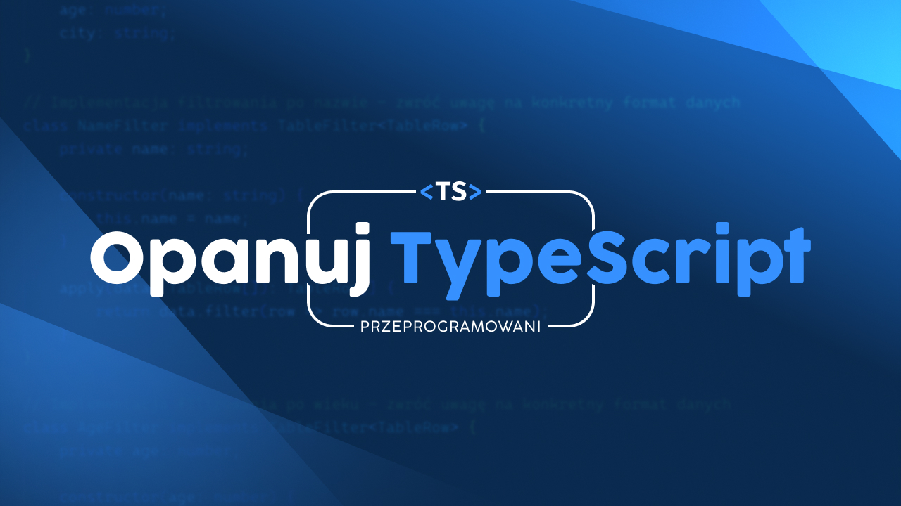

# typescript-challenges

## A set of challenges that help you understand TypeScript 🚀

**Setup & Installation**

Clone this repository and run `npm install`. You're good to go!

**How to**

- Each directory in `src` represents a challenge related to a specific feature of TypeScript.
- In each challenge your solution have to pass two kinds of tests - **TypeScript compilation** and **unit tests**
- Challenge of name `XYZ` can be verified by running `npm run test:XYZ`, for example: `npm run test:warm-up`

**Test commands for challenges**

- `npm run test:warm-up`
- `npm run test:media`
- `npm run test:shortcuts`
- `npm run test:this-or-that`
- `npm run test:only-one`
- `npm run test:new-skills`
- `npm run test:constraints`

**Help me, I'm stuck!**

Find all the answers in [TypeScript Documentation](https://www.typescriptlang.org/docs/home.html)
