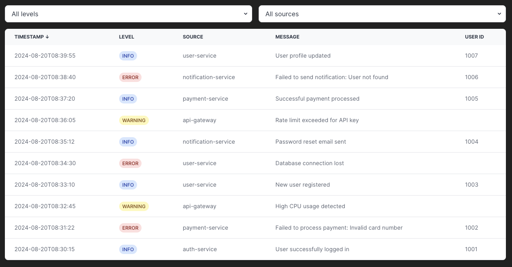

# Advanced Filtering with TypeScript and React Challenge

The project is a React application that displays a list of log entries and allows users to filter them by different criteria.



Challenge focuses on practicing generics and advanced typing concepts in TypeScript, particularly in the context of filtering log entries.

Initial implementation of filtering code is provided, but it's not properly typed. Your task is to refactor the code and make sure it's fully typed in a robust and flexible way.

## 🚀 How to get started

1. Install the dependencies:

```bash
npm install
```

2. Run the application and see how it works:

```bash
npm run dev
```

3. Dive into the code and start refactoring types in the filtering-related code.

4. Lint and build the application:

```bash
npm run build
```

## 🤝 Helper materials

1. Read the ["Typy Generyczne w TypeScript"](https://opanujtypescript.pl/ebook/typy-generyczne-typescript/) ebook (in Polish)
2. Watch YouTube video ["Zaawansowany TypeScript w praktyce: Refaktoryzacja projektu"]() (in Polish) - it shows the process of refactoring a sorting-related code in a similar way.

## 🌟 Example solution

As this is an advanced challenge, there is no single correct solution. However, you can find an example solution in the [Pull Request: Example solution for Advanced Filtering Challenge](https://github.com/przeprogramowani/typescript-challenges/pull/31).

Before checking the solution, try to solve the challenge on your own! Use sorting-related code as a reference and try to apply similar typing techniques to filtering-related code.
